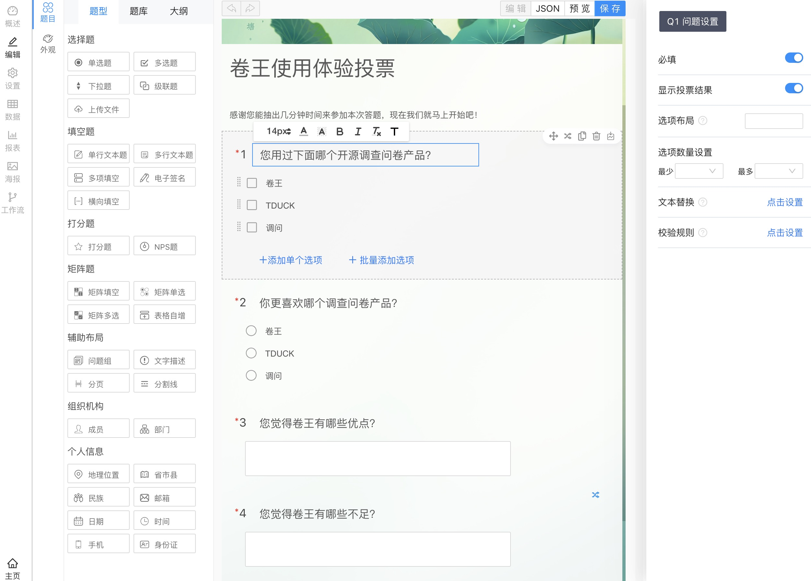
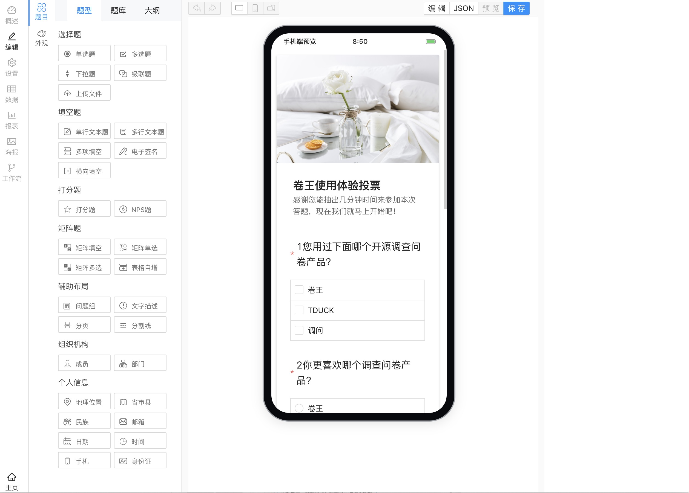
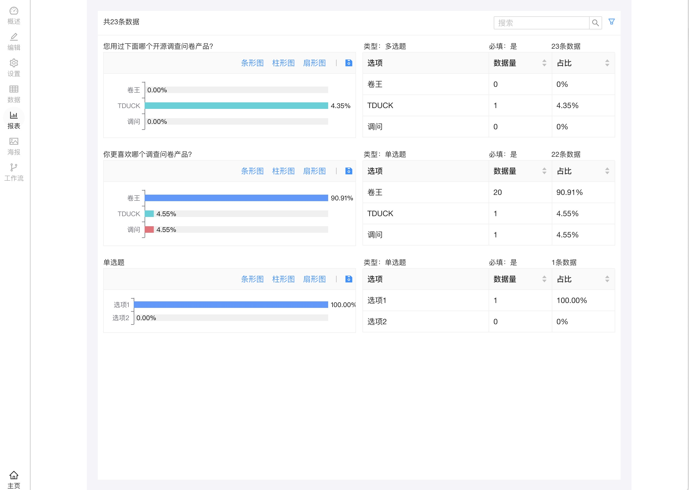
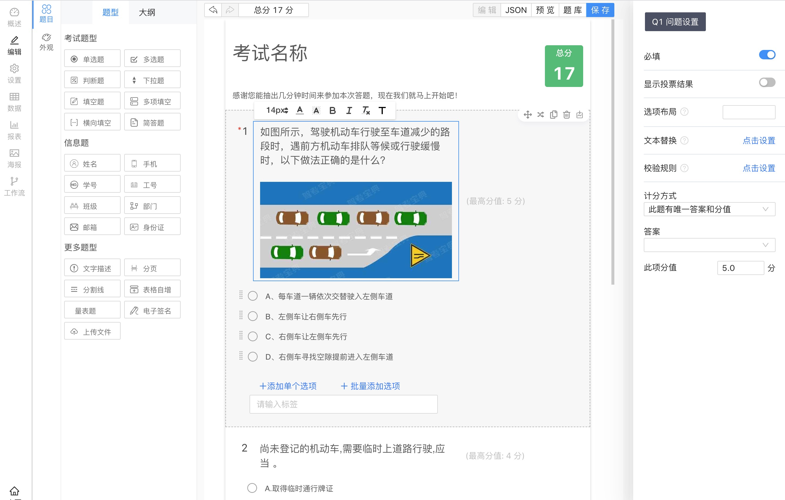
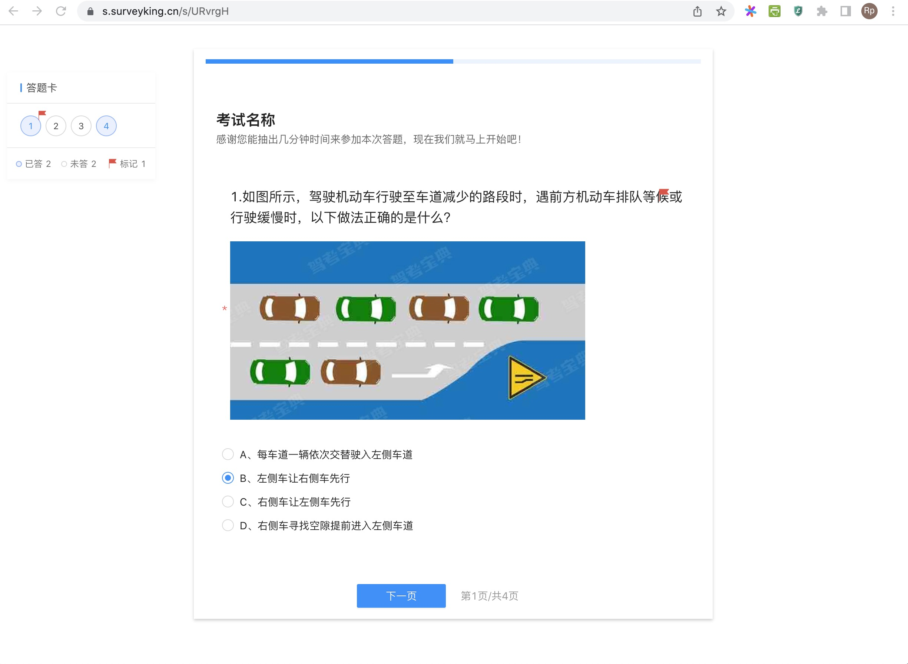
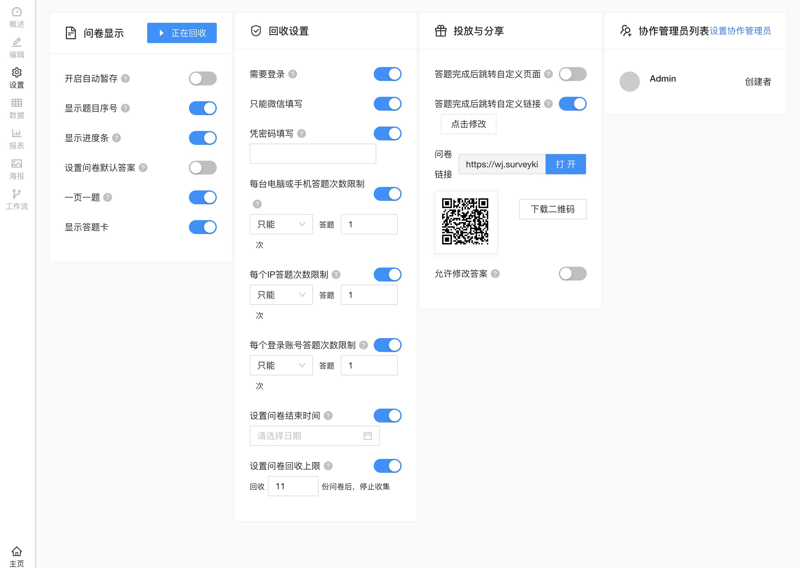

# SurveyKing · AI-Powered Open-Source Survey & Exam Platform

<p align="center">
  <a href="https://github.com/javahuang/surveyking" target="_blank">
    
  </a>
  <a href="https://github.com/javahuang/surveyking/forks" target="_blank">
    
  </a>
  <br />
  
  
  
  
</p>

[English](./README.md) | [简体中文](./README.zh-CN.md)

> **Fork 维护版 v1.0.7**：本项目为 [SurveyKing](https://github.com/javahuang/surveyking) 的分支维护版本（hanyuestar/surveyking），
> 基于上游 Apache-2.0/MIT 开源项目二次开发，保留上游核心作者 javahuang 署名与许可声明。

SurveyKing is an AI-powered, enterprise-grade survey and online exam system. Create professional surveys from natural language, run exams with item banks and auto-grading, and publish across web and mobile — all open source.

> One command to deploy a more powerful, self-hosted alternative to SurveyMonkey — with built-in exams, item bank, and AI generation.

## Key Features

- **AI survey generation** from natural language prompts; supports multiple mainstream models
- **20+ question types**: text, choice, dropdown, matrix, cascader, file upload, signature, pagination, question groups, and more
- **Powerful logic engine**: show/hide logic, required rules, skip/branching, calculations, randomization
- **Survey and exam modes**: item bank, question picker, randomized papers, automatic grading, import/export
- **Real-time analytics** and exportable reports (CSV/Excel/PDF)
- **Collaboration and roles**: multi-user management, role-based permissions (RBAC), departments and positions
- **Region dictionary (region)**: five-level administrative division dictionary (province/city/district/street/village, 660k+ entries) auto-imported on first MySQL initialization
- **Responsive across devices**: desktop, mobile, and WeChat Mini Program
- **One-click deploy** via Docker Compose (MySQL 8) or embedded H2
- **Multi-language (i18n)**: English and Simplified Chinese today; more languages coming
- **外挂密码重置（godSecret, v1.0.0 新增）**: deployers set `GOD_SECRET` at deploy time. The login page no longer exposes any built-in reset entry; instead, a standalone `god-secret-reset.html` tool is bundled for zero-rebuild resets from any browser. Open the HTML file, fill in the service URL, `GOD_SECRET`, username and new password, then call `/api/public/resetPassword` directly to reset any account password (including `admin`) without database access. Resetting invalidates the account's existing tokens. If `GOD_SECRET` is not set, the API rejects the request. The SQLite compose defaults `GOD_SECRET=super666` so the recovery channel works out of the box.

## Quick Deploy (Docker Compose, recommended)

1. Set the emergency password (optional but recommended):

```bash
export GOD_SECRET='your-strong-secret'
```

2. Start MySQL 8 + application:

```bash
docker compose up -d
```

3. Open http://localhost:1991 and sign in:

- Username: `admin`
- Password: `666666`

Data persistence: three named volumes (`mysql-data`, `app-files`, `app-logs`) keep your database, uploaded files and logs across container restarts. Data is not lost when containers are recreated.

Database auto-initialization: on the first start (empty data volume), the MySQL container runs `01-init-mysql.sql` (schema + default admin) then `02-data-region-dict.sql.gz` (five-level region dictionary, ~660k entries; `.sql.gz` is decompressed automatically by the MySQL image). Scripts are idempotent; they only run when the data volume is empty.

> **godSecret notes**: it is injected only via the `GOD_SECRET` environment variable at startup and **cannot be changed at runtime** — a restart is required to change it. Never expose it in the frontend, logs, or API responses. The SQLite compose (`docker-compose.sqlite.yml`) defaults `GOD_SECRET=super666` so a recovery channel is available immediately; the MySQL compose leaves it empty (set your own strong secret). A standalone reset tool is bundled at `god-secret-reset.html`.

> **Build prerequisite**: this compose file builds the app image from the local Maven artifact (`server/api/target/surveyking-v1.0.0.jar`), so run `cd server && mvn clean package -DskipTests -Ppro` first.

## Quick Start (standalone Docker image, embedded H2)

```bash
docker run -d -p 1991:1991 kyson666/surveyking
```

Then open http://localhost:1991 and sign in with `admin` / `666666`.

## Docker (advanced)

Persist files and logs on the host:

```bash
docker run -d \
  -p 1991:1991 \
  -v ${PWD}/files:/files \
  -v ${PWD}/logs:/logs \
  kyson666/surveyking
```

Connect to an external MySQL (auto-migrates schema on first run):

```bash
docker run -d \
  -p 1991:1991 \
  -e PROFILE=mysql \
  -e MYSQL_USER=surveyking \
  -e MYSQL_PASS=surveyking \
  -e DB_URL='jdbc:mysql://172.17.0.1:3306/surveyking?rewriteBatchedStatements=true&useUnicode=true&characterEncoding=UTF-8' \
  -v ${PWD}/files:/files \
  -v ${PWD}/logs:/logs \
  kyson666/surveyking
```

## Screenshots

<table>
  <tr>
    <td></td>
    <td></td>
    <td></td>
  </tr>
  <tr>
    <td></td>
    <td></td>
    <td></td>
  </tr>
  <tr>
    <td colspan="3" align="center">More screenshots in the docs folder.</td>
  </tr>
</table>

## Internationalization

- Current languages: English, Simplified Chinese
- More languages are on the way; community contributions are welcome

## Contributing

Issues and pull requests are welcome. If you like SurveyKing, please give us a star — it really helps.

## License

MIT License © SurveyKing contributors

Upstream project: [SurveyKing](https://github.com/javahuang/surveyking) by javahuang (Apache-2.0/MIT).
