# 🎯 卷王 SurveyKing

<p align="center">
    </img>
    </img>
    <br />
    </img>
    </img>
    </img>
    </img>
</p>

[简体中文](./README.zh-CN.md) | [English](./README.md)

> **Fork 维护版 v1.0.5**：本项目为 [SurveyKing](https://github.com/javahuang/surveyking) 的分支维护版本（hanyuestar/surveyking），
> 基于上游开源项目二次开发，保留上游核心作者 javahuang 署名与许可声明。

## 🚀 AI 驱动的开源问卷考试系统

### ✨ 核心亮点

- 🤖 **AI 智能创建** - 业界首创 AI 问卷生成，自然语言描述即可生成专业问卷
- 📊 **20+ 题型支持** - 覆盖填空、选择、矩阵、签名等所有主流题型
- 🎯 **强大逻辑引擎** - 支持复杂的显示隐藏、跳转、计算等业务逻辑
- 📱 **全平台适配** - 完美适配 PC、移动端、微信小程序等所有终端
- ⚡ **一键部署** - 支持 docker-compose、Docker 等多种方式快速部署

### 📋 功能特性清单

- 📝 **调查问卷** - 20+ 题型、逻辑引擎、白名单答卷、公开查询、答卷限制、定时发布、Excel/文本导入
- ✅ **在线考试** - 智能组卷、题库选题、随机试卷、自动评分、成绩统计、防作弊随机排序
- 🗂️ **题库管理** - 题库/模板、题目导入导出、错题本、刷题练习
- 👥 **用户与组织** - 多用户管理、RBAC 角色权限、部门/职位管理、字典管理
- 🗺️ **行政区划字典（region）** - 预置五级行政区划（省/市/区县/街道/村居，66 万余条），部署时随 MySQL 首次初始化自动导入
- 📊 **数据统计** - 实时统计分析、条形图/柱形图/扇形图、Excel/PDF/图片导出
- 🔑 **外挂密码重置（godSecret，v1.0.0 新增）** - 部署时设置 `GOD_SECRET`，登录页提供三处入口：右上角钥匙按钮、右上角"🔑 外挂密码重置"文字链接、登录按钮下方的"忘记密码？使用外挂密码重置"链接，任意一处均可无需数据库直连重置任意账户密码（含 admin）；仓库另附独立工具 `god-secret-reset.html`，浏览器打开即零重建重置；重置后该账户旧 token 全部失效；未设置时三处入口全部隐藏。SQLite 版默认 `GOD_SECRET=super666`，开箱即带恢复通道

## 🚀 快速部署（Docker Compose 一键部署，推荐）

### 1. 设置外挂密码（可选，推荐设置）

```bash
export GOD_SECRET='your-strong-secret'
```

> **godSecret 说明**：仅部署时经环境变量 `GOD_SECRET` 注入，**运行期不可修改**（修改需重启容器）；未设置时登录页不显示任何入口，功能关闭。SQLite 版（`docker-compose.sqlite.yml`）默认 `GOD_SECRET=super666`，开箱即用；MySQL 版需自行设置。仓库根目录附独立重置工具 `god-secret-reset.html`（浏览器打开即可零重建重置）。

### 2. 本地构建 Maven 产物（主构建）

```bash
cd server
mvn clean package -DskipTests -Ppro
```

### 3. 一键启动

```bash
docker compose up -d
```

### 4. 访问系统

打开浏览器访问 [http://localhost:1991](http://localhost:1991)，默认账号：_admin_ / _666666_

### 数据持久化

- 三个命名卷：`mysql-data`（数据库）、`app-files`（上传文件）、`app-logs`（日志）
- 删除/重建容器**数据不丢失**；如需彻底清理：`docker compose down -v`

### 数据库自动初始化

首次启动（空数据卷）时 MySQL 容器按序自动执行：

1. `01-init-mysql.sql` - 建表 + 默认 admin 账户
2. `02-data-region-dict.sql.gz` - 预置行政区划字典（region，五级全量，约 66 万条；`.sql.gz` 由 MySQL 镜像自动解压执行）

> 数据卷已存在时不会重复执行；如需重新导入，清空数据卷后重新 `docker compose up -d`（注意会丢失既有数据），或手动在 MySQL 中执行 `data-region-dict.sql.gz` 解压后的脚本（脚本幂等，可重复执行）。

### 排查指引

- **端口冲突**：修改 `docker-compose.yml` 中 `ports: "1991:1991"` 左侧宿主机端口
- **镜像拉取失败**：确认网络可访问 Docker Hub；MySQL 使用官方 `mysql:8.0` 镜像
- **应用启动失败**：执行 `docker compose logs app` 查看日志；确认 MySQL 健康检查通过（`docker compose ps`）

## 快速开始（单机 Docker，内置 H2）

```bash
# 一键启动，默认使用内置的 h2 数据库
docker run -d -p 1991:1991 kyson666/surveyking
```

打开浏览器访问 [http://localhost:1991](http://localhost:1991)，输入账号密码：_admin_/_666666_

## 🌟 核心特性

### 🤖 AI 智能创建功能

- **🎯 自然语言生成** - 支持通过自然语言描述直接生成专业问卷，如"创建一个产品满意度调查"
- **🔧 多模型支持** - 集成 SiliconFlow 平台，支持 DeepSeek、Qwen、Llama 等多种主流 AI 模型
- **⚡ 实时生成** - AI 流式输出，实时预览问卷生成过程，所见即所得
- **🎨 智能优化** - AI 自动优化问题逻辑、题型选择和问卷结构

### 📋 丰富的题型和功能

- 🥇 **20+ 题型支持** - 填空、选择、下拉、级联、矩阵、分页、签名、题组、上传、横向填空等全覆盖
- 🎉 **多种创建方式** - AI 智能创建、Excel 导入、文本导入、在线编辑器等多种方式任选
- 💪 **灵活问卷设置** - 白名单答卷、公开查询、答卷限制、定时发布等高级功能
- 📊 **强大逻辑引擎** - 可视化配置问卷跳转和显示逻辑，支持复杂公式计算（超越主流商业系统）

### 📈 数据分析与报表

- 🎇 **全面数据管理** - 问卷数据新增、编辑、标记、导出、打印、预览和附件打包下载
- 🎨 **智能报表生成** - 实时统计分析，支持条形图、柱形图、扇形图等多种图表展示
- 📤 **多格式导出** - 支持 Excel、PDF、图片等多种格式的数据和报表导出

### 🚀 部署与技术特性

- ⚡ **极简部署** - 支持 Docker Compose 一键部署、Docker、K8s 等多种部署方式
- 📱 **全平台适配** - 响应式设计，完美适配 PC、移动端、平板等所有设备
- 👥 **协作与权限** - 多人协作管理、完善的 RBAC 权限控制、组织架构管理
- 💾 **数据库兼容** - 支持 MySQL、H2 等主流关系型数据库
- 🔒 **企业级安全** - 安全、可靠、稳定的后端架构，支持高并发场景

### 🧠 高级逻辑引擎（业界领先）

卷王的逻辑设置功能远超主流商业问卷系统，支持以下十大逻辑类型：

- **显示隐藏逻辑** - 根据条件动态显示或隐藏问题
- **值计算逻辑** - 动态计算问题答案，支持从简单的 BMI 计算到复杂的多问题组合运算
- **文本替换逻辑** - 动态替换题目内容，实现个性化问卷
- **值校验逻辑** - 基于其他问题答案进行当前问题有效性验证
- **必填逻辑** - 动态判断问题是否必填
- **选项自动勾选逻辑** - 根据其他问题答案自动勾选选项
- **选项显示隐藏逻辑** - 动态控制选项的显示和隐藏
- **结束问卷逻辑** - 根据条件提前结束问卷
- **跳转逻辑** - 智能跳转到指定问题或页面
- **自定义提示和跳转** - 根据答案或分数显示不同提示语、跳转不同链接

### 🎯 考试系统专属功能

- 🏆 **智能组卷** - AI 辅助题库组卷，自动平衡难度分布
- ⏱️ **自动评分** - 实时计算分数，支持多种计分规则
- 📊 **成绩统计** - 详细的考试数据分析和成绩报表
- 🔄 **题目随机** - 支持题目和选项随机排序，防止作弊

## 🏆 产品对比优势

|                      | 问卷网  | 腾讯问卷 | 问卷星  | 金数据  | 卷王 SurveyKing        |
| -------------------- | ------- | -------- | ------- | ------- | ---------------------- |
| 📋 问卷调查          | ✔️    | ✔️     | ✔️    | ✔️    | ✔️                   |
| ✅ 在线考试          | ✔️    | ✔️     | ✔️    | ✔️    | ✔️                   |
| 🗳️ 投票评选        | ✔️    | ✔️     | ✔️    | ✔️    | ✔️                   |
| 📝 支持题型          | 🥇      | 🥉       | 🥇      | 🥈      | **🥇 20+ 题型**  |
| ⚙️ 题型设置        | 🥇      | 🥉       | 🥇      | 🥇      | **🥇 最灵活**    |
| 🧮 自动计算          | 🥉      | 🥉       | 🥉      | 🥈      | **🥇 最强大**    |
| 🧠 逻辑设置          | 🥈      | 🥈       | 🥈      | 🥈      | **🥇 十大逻辑**  |
| ✅ 自定义校验        | ❌      | ❌       | ❌      | ❌      | **✔️ 独有**    |
| 📤 自定义导出        | 🥈      | ❌       | ❌      | 🥉      | **🥇 最丰富**    |
| 📱 手机端编辑        | ✔️    | ✔️     | ✔️    | ✔️    | ✔️                   |
| 🔍 公开查询          | ✔️    | ❌       | ✔️    | ✔️    | ✔️                   |
| 🏠**私有部署** | 💰💰💰  | 💰💰💰   | 💰💰💰  | 💰💰💰  | **🆓 完全免费**  |
| ⚡ 部署难度          | 🥉 复杂 | 🥉 复杂  | 🥉 复杂 | 🥉 复杂 | **🥇 1分钟部署** |
| 🔓 开源协议          | ❌ 闭源 | ❌ 闭源  | ❌ 闭源 | ❌ 闭源 | **✔️ MIT**     |

> 💡 **对比说明**：上表对比的均为商业问卷产品，各有特色值得学习。卷王作为开源产品，**在 AI 功能、私有部署、开源协议方面具有绝对优势**。
>
> 🎯 **核心优势**：**全球首个 AI 驱动的开源问卷系统**，让问卷创建从此告别繁琐操作！

### 🤖 AI 功能详细介绍

#### 🎯 使用场景示例

```
用户输入："创建一个员工满意度调查问卷"
AI 输出：自动生成包含工作环境、薪酬福利、职业发展等维度的专业问卷
```

#### 🔧 技术特点

- **多模型支持** - 集成 DeepSeek、Qwen、Llama 等主流 AI 模型
- **流式输出** - 实时显示生成过程，支持中途调整
- **智能优化** - 自动优化问题逻辑和题型选择
- **快速上手** - 无需 AI 知识，自然语言描述即可

#### ⚙️ 配置简单

管理员只需在后台配置 AI Token，用户即可在创建问卷时选择 "AI 智能创建" 功能。

## 📸 产品截图预览

### 🤖 AI 智能创建功能

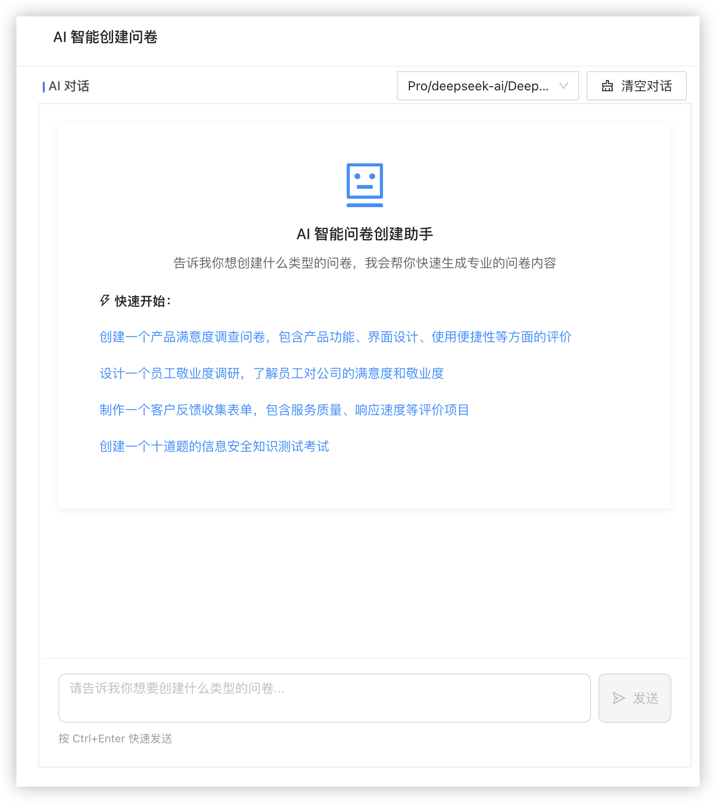

### 📋 问卷系统功能

## 📸 更多截图

- 考试系统预览

<table>
    <tr>
        <td></td>
        <td>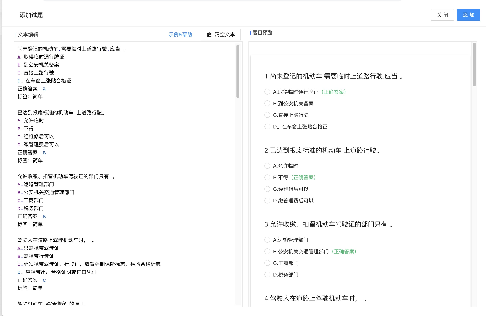</td>
    </tr>
     <tr>
        <td></td>
        <td>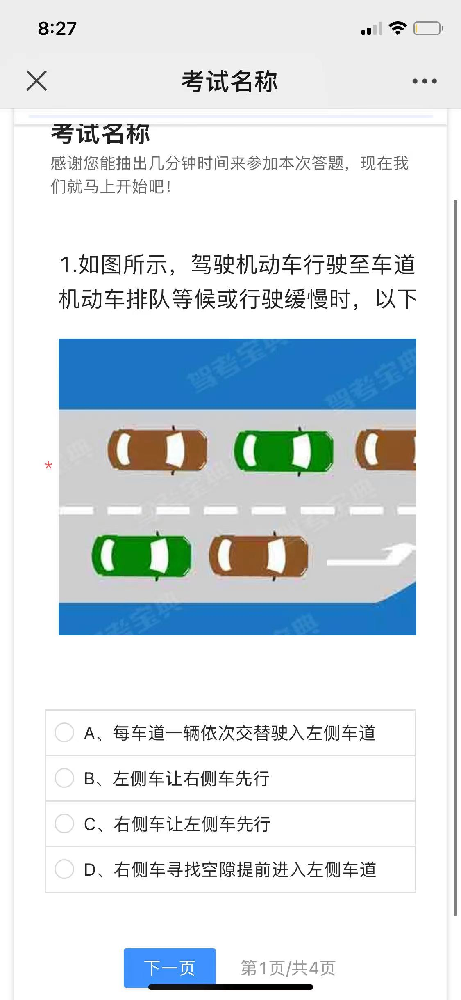</td>
    </tr>
     <tr>
        <td>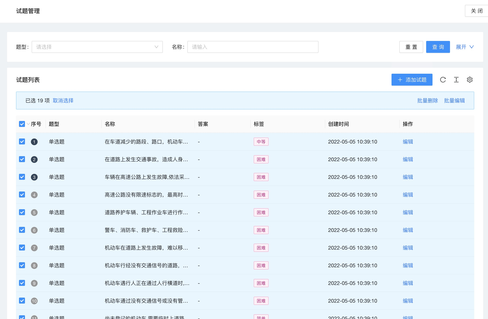</td>
        <td>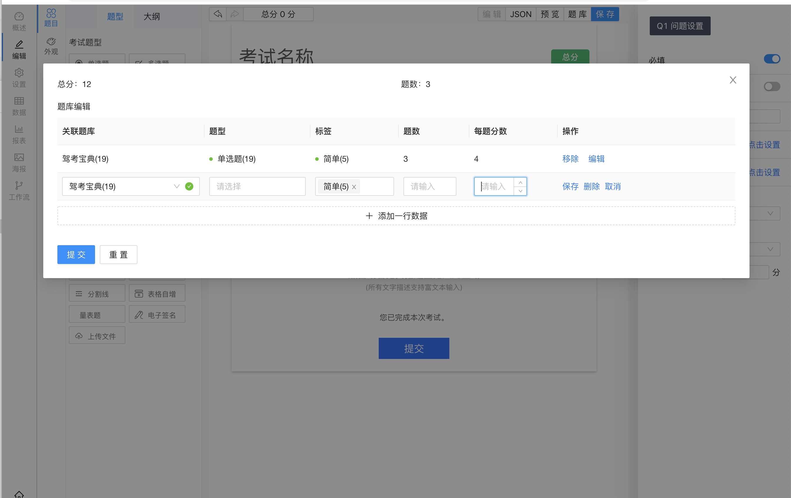</td>
    </tr>
     <tr>
        <td>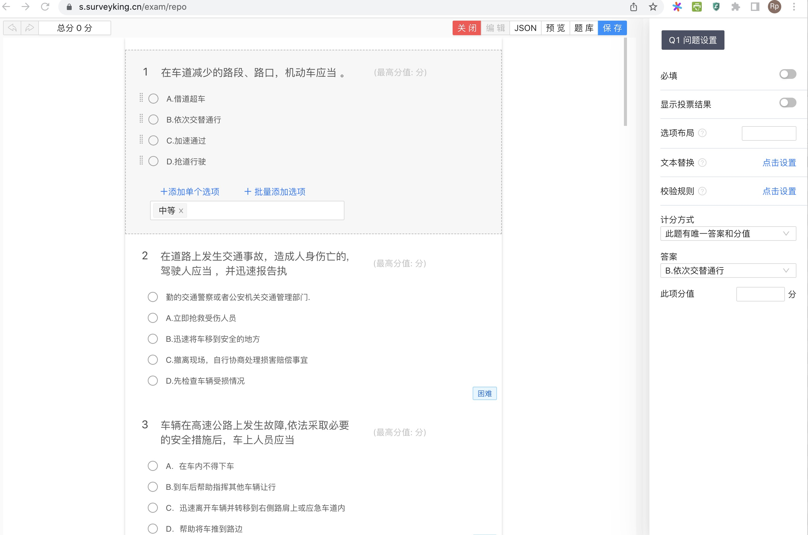</td>
        <td>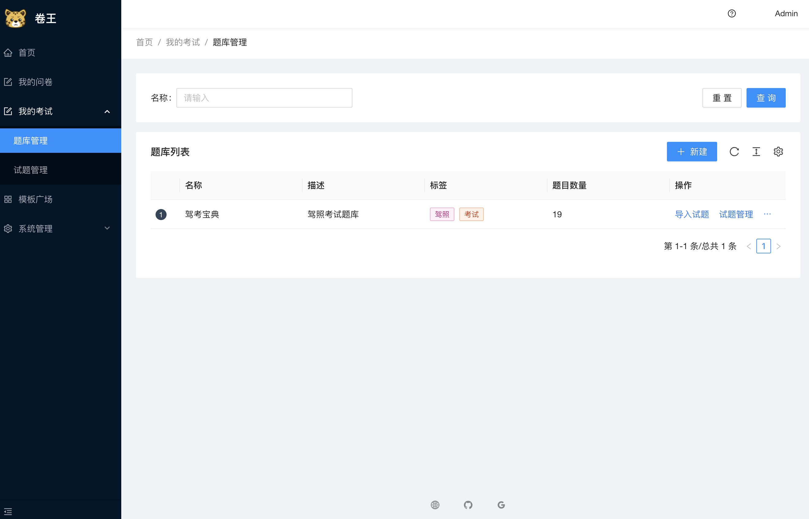</td>
    </tr>
</table>

- 调查问卷预览

<table>
    <tr>
        <td></td>
        <td>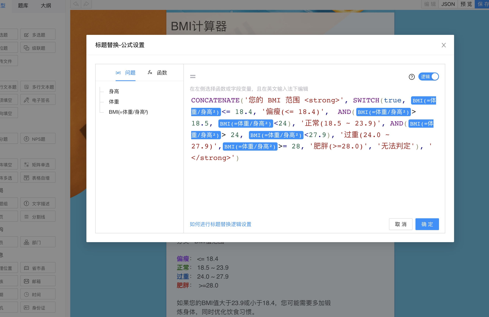</td>
    </tr>
    <tr>
        <td></td>
        <td>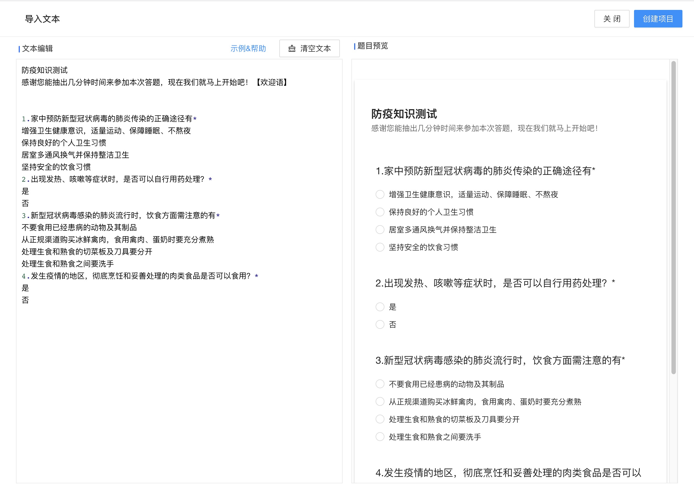</td>
    </tr>
    <tr>
        <td>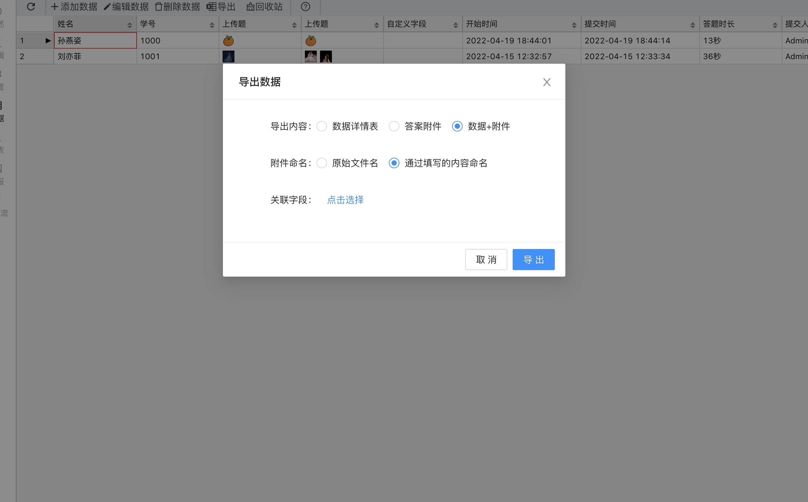</td>
        <td></td>
    </tr>
    <tr>
        <td>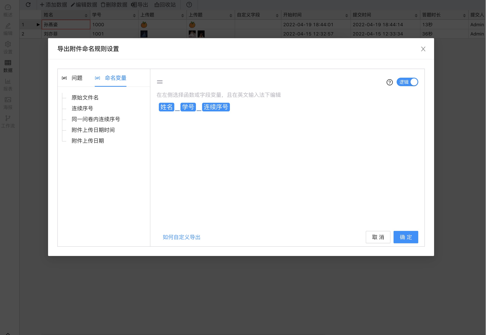</td>
        <td>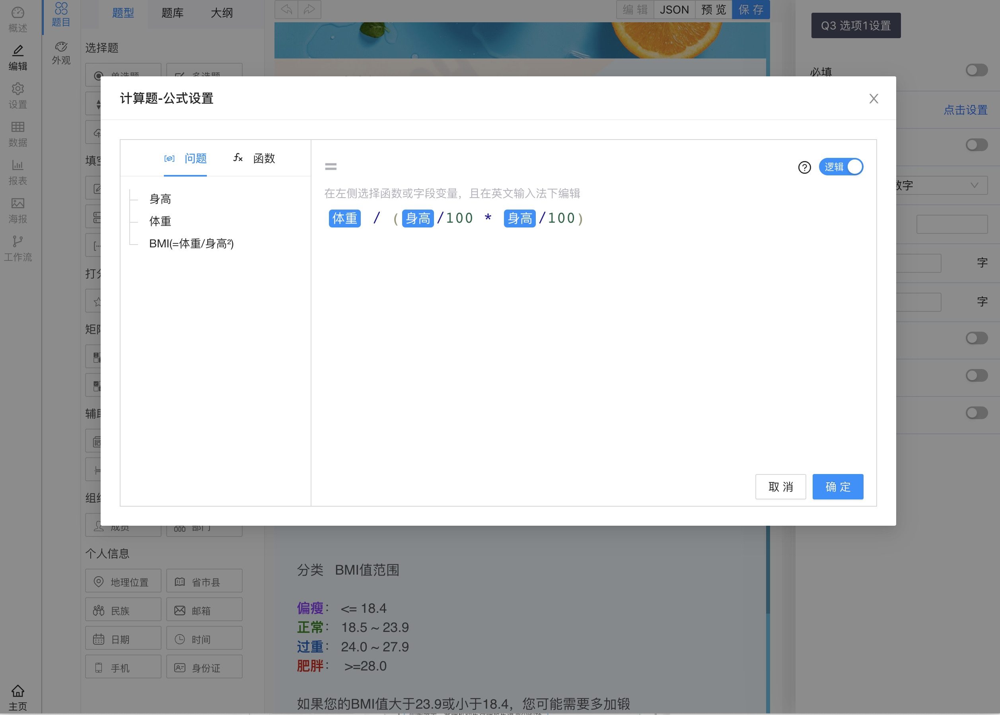</td>
    </tr>
    <tr>
        <td></td>
        <td>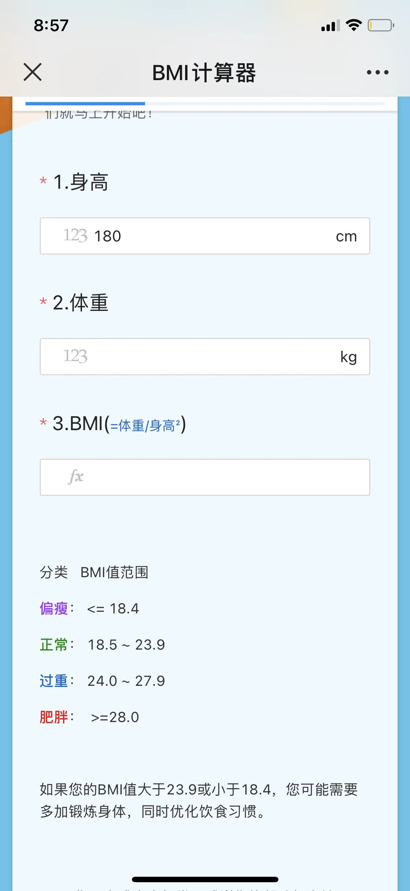</td>
    </tr>
    <tr>
        <td></td>
        <td></td>
    </tr>
    <tr>
        <td>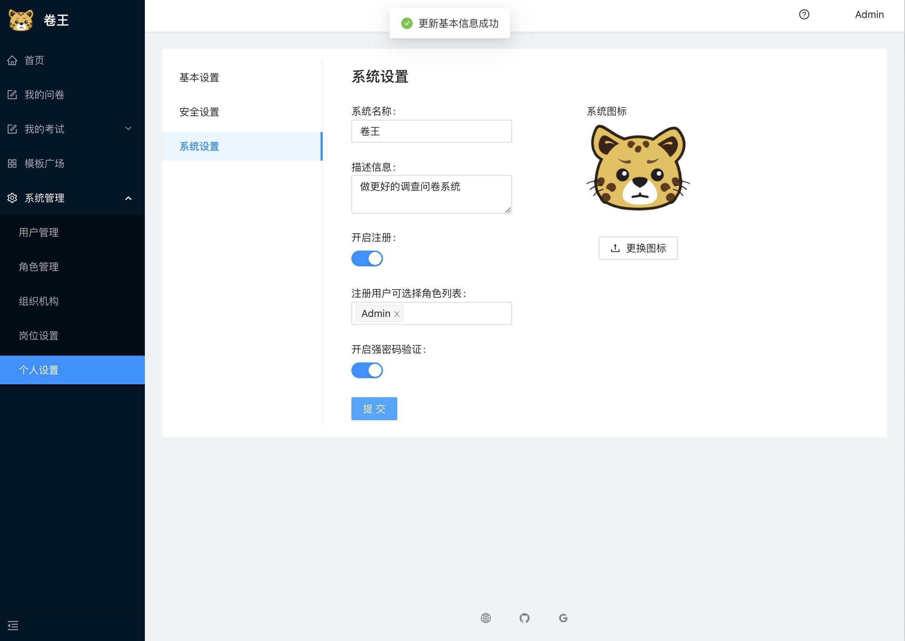</td>
        <td>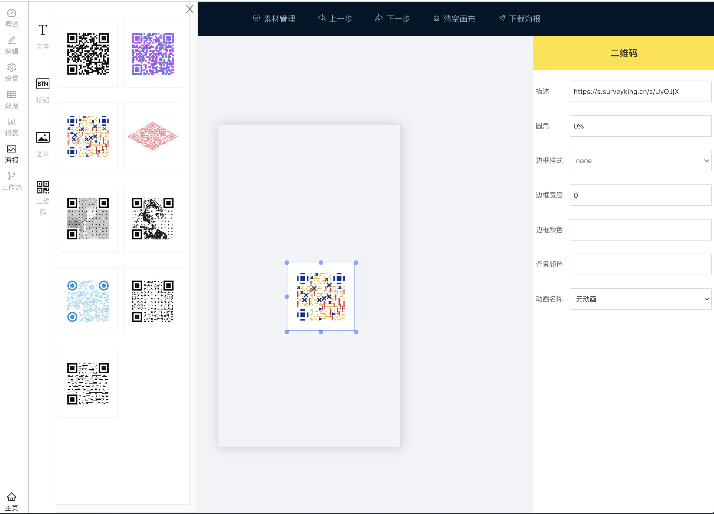</td>
    </tr>
</table>

## 📄 许可与署名

- **开源协议**：MIT License（详见 [LICENSE](./LICENSE)）
- **上游项目**：[SurveyKing](https://github.com/javahuang/surveyking) by javahuang（Apache-2.0/MIT）
- 本 fork 保留上游版权声明与核心作者技术署名，仅清理与本仓库无关的推广/统计内容。
